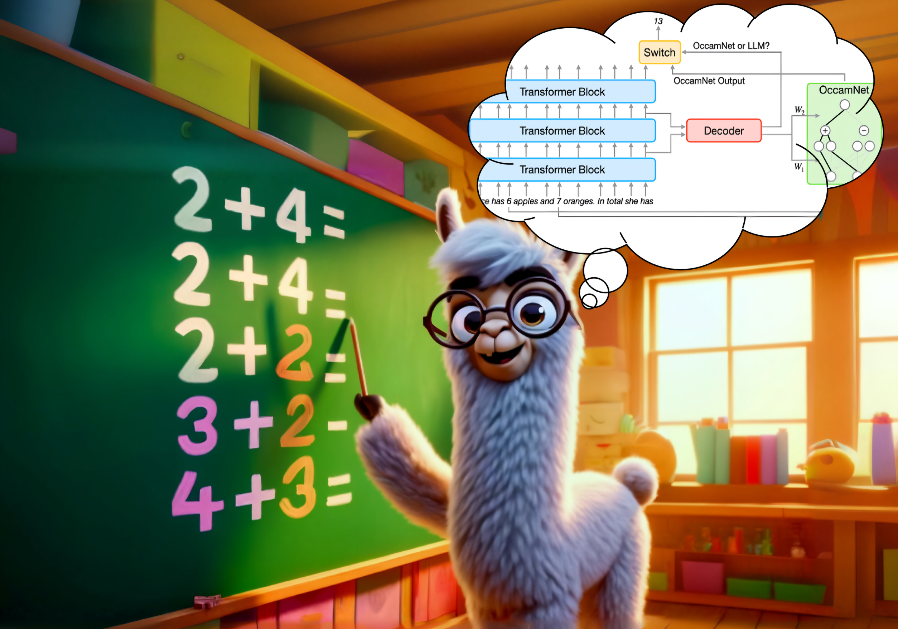
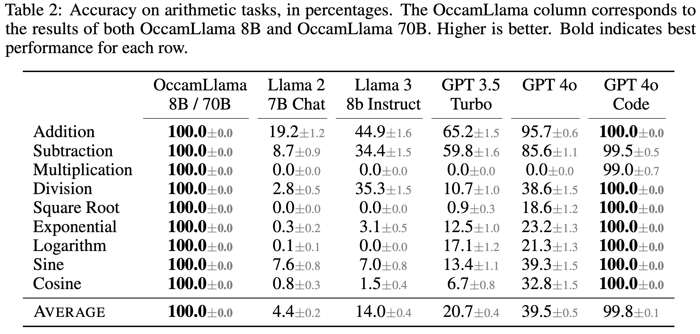
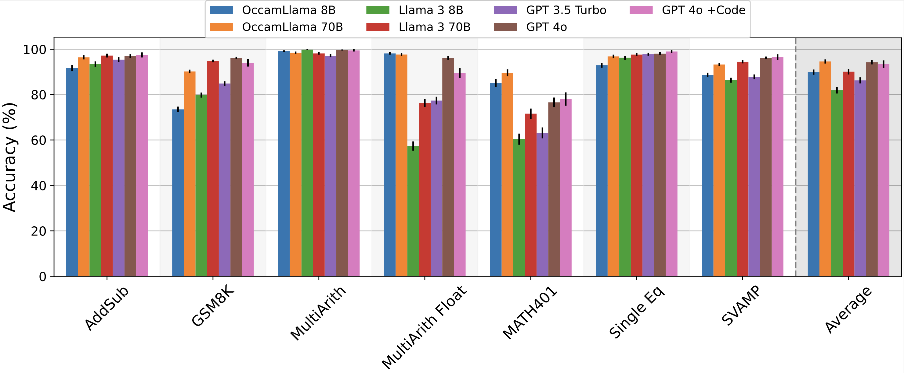
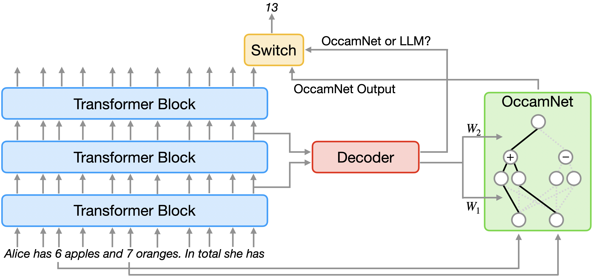

# OccamLLM: Fast and Exact Language Model Arithmetic in a Single Step

This is the code for [OccamLLM: Fast and Exact Language Model Arithmetic in a Single Step](https://arxiv.org/abs/2406.06576v4). OccamLLM is a novel method for exact language-model arithmetic in a single autoregressive step, with no code generation or LLM finetuning needed!

Current LLMs struggle with complex arithmetic. Our solution? OccamLLM—a novel framework that integrates a symbolic architecture (OccamNet) directly with LLM hidden states for precise and efficient calculations.

Here are some key results regarding the performance of OccamLlama (OccamLLM + Llama):
* OccamLlama achieves 100% accuracy on basic arithmetic (+,−,⨉,÷,√,sin,cos,log,exp), beating GPT-4o* + Code Interpreter. It also outputs the correct answer in 1 autoregressive step, compared to on average ~50 tokens generated by GPT-4o + Code Interpreter.

* On average, across math benchmarks (shown below), OccamLlama 8B matches Llama 70B, and OccamLlama 70B slightly outperforms GPT 4o*. This showcases OccamLlama's ability to sustain long-form calculations that mix arithmetic and reasoning. 

*All tests conducted with gpt-4o-2024-05-13.

So how does OccamLLM work? At each autoregressive step, the LLM hidden states control OccamNet, deciding which operations to perform. The hidden states also control a switch, which decides whether to use the LLM or OccamNet outputs for each generation step.

We train OccamLLM using a combination of supervised and reinforcement learning on a dataset consisting of synthetic training data and a small number of annotated word problems. Dataset creation requires minimal effort, and training even OccamLlama70B takes no more than two days on a two-A100 system.

By enhancing LLM arithmetic capabilities without increasing the number of LLM generation steps, we believe OccamLLM will enable faster and more capable LLM systems, including faster agents or more capable on-device models.

## Using OccamLLM

To train an OccamLLM, call `finetune_occamnet_decoder.py` and `finetune_router.py`. To evaluate an OccamLLM or a baseline, call `eval_llm.py`.

We have set up helper functions to train and evaluate OccamLlama 8B/70B on SLURM clusters. For training, run `sbatch ft_*B_occamnet.sh` and `sbatch ft_*B_router.sh`, and for evaluation, run `eval_occamllama.py -b *` where `*` is either 8 or 70.

Results from our experiments are contained in `results`. `plot_results.ipynb` and `generate_latex_tables.ipynb` contain code to generate key figures and tables from the paper.